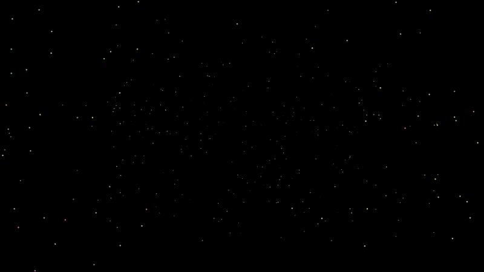
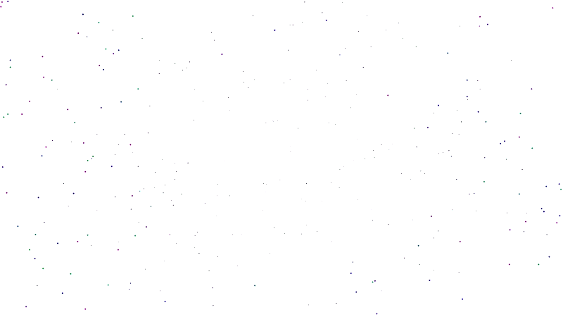

# Stars
Realization of a very famous screensaver "through the Universe" using Python, OpenCV and NumPy.
Purpose: to test the performance of random access to an array elements in this bundle.

Worked program looks like this:

And with inverted colors option like this:

## Control keys:

| Keys | Desctiption |
| --- | --- |
| Q/q | Close window and exit |
| ESC | The same as 'Q' |
|Enter | Switch to Full screen mode |
| R/r | Start/Stop record video to Stars.avi file. Recorded each 4th frame. |
| I/i | Invert all screen colors |

## Files:
	
* [stars.py](stars.py) - Main program
* README.md - This readme file
* LICENSE - GNU GENERAL PUBLIC LICENSE

## Requirements:

* Python
* NumPY
* OpenCV

# AUTHOR
   An0ther0ne
   
   
